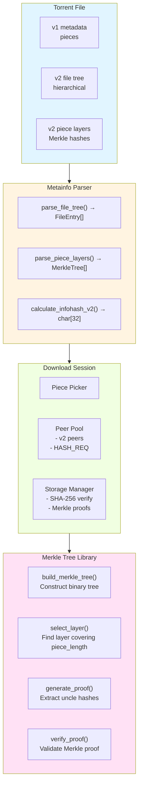
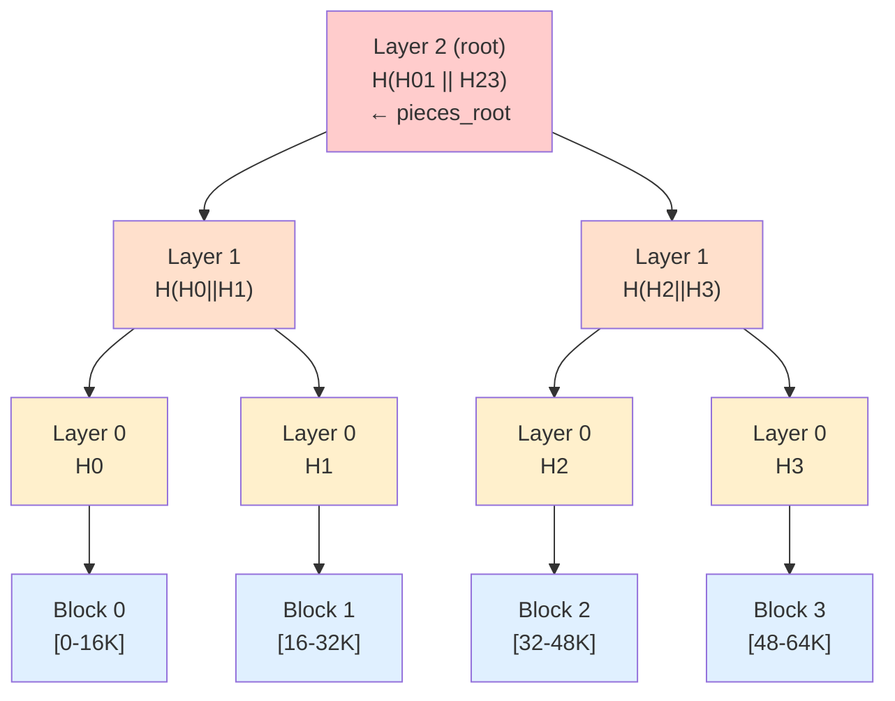
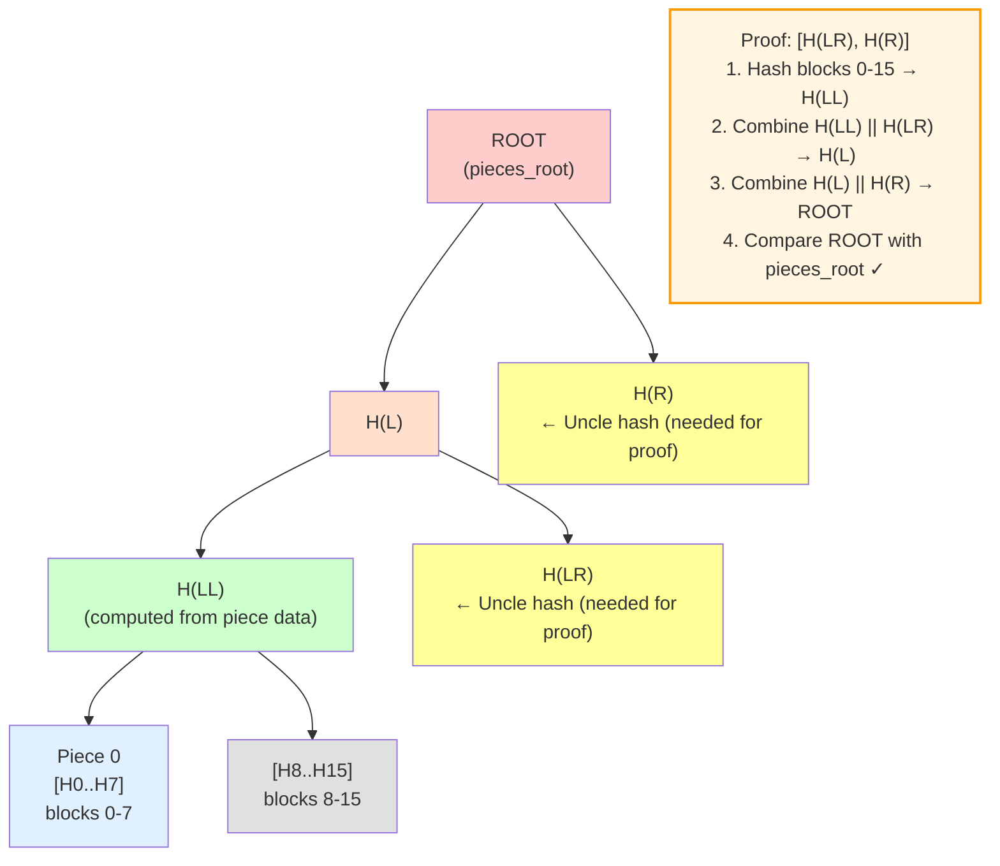
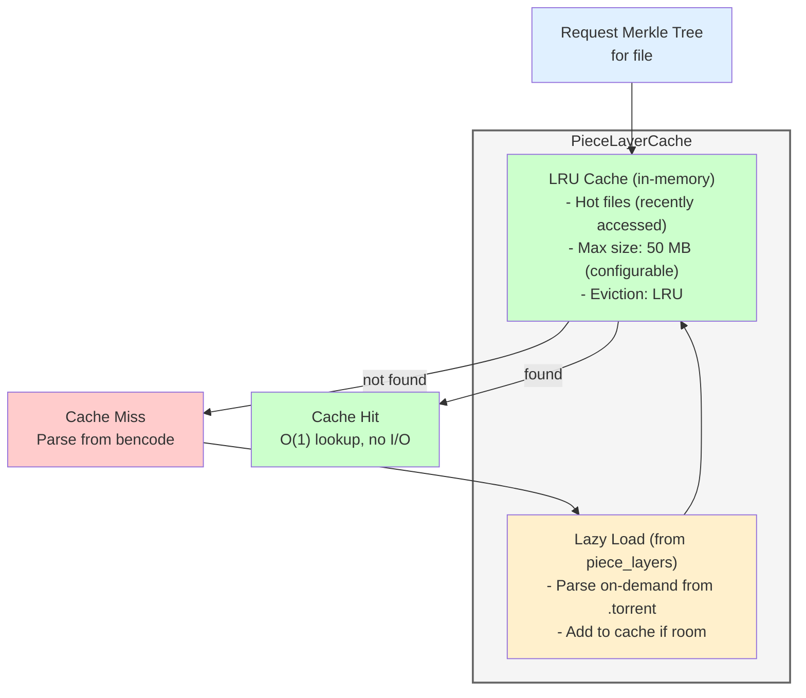

# BEP 52 Implementation: BitTorrent Protocol Specification v2

## Table of Contents

1. [Overview](#overview)
2. [Architecture](#architecture)
3. [Merkle Tree Design](#merkle-tree-design)
4. [Metadata Format](#metadata-format)
5. [Data Structures](#data-structures)
6. [Network Protocol](#network-protocol)
7. [Storage & Verification](#storage--verification)
8. [Torrent Creation](#torrent-creation)
9. [Implementation Phases](#implementation-phases)
10. [Testing Strategy](#testing-strategy)
11. [Performance Considerations](#performance-considerations)
12. [Compatibility](#compatibility)

---

## Overview

### What is BEP 52?

BEP 52 is a major upgrade to the BitTorrent protocol that introduces:

- **SHA-256 hashing** instead of SHA-1 (future-proof, collision-resistant)
- **Merkle tree-based piece verification** (efficient, supports selective verification)
- **Per-file piece alignment** (files start at piece boundaries)
- **Hierarchical file trees** (better metadata organization)
- **Hybrid torrents** (v1 + v2 in same .torrent for backward compatibility)

### Why Implement It?

1. **Future-proofing:** SHA-1 is deprecated due to collision attacks
2. **Industry adoption:** qBittorrent, Transmission, libtorrent-rasterbar all support v2
3. **Better features:** Per-file hashing enables selective verification
4. **Ecosystem growth:** New torrents increasingly use v2 format

### Scope of Implementation

**Full implementation including:**
- ✅ Parse v2 and hybrid .torrent files
- ✅ Verify pieces using Merkle proofs
- ✅ Download v2 torrents from network
- ✅ Exchange Merkle proofs with peers (messages 21-23)
- ✅ Create v2 and hybrid .torrent files
- ✅ Backward compatibility with v1 torrents

---

## Architecture

### Component Overview



### Data Flow

#### Download Flow (v2 torrent)

```
1. Parse .torrent → Extract file tree + piece layers
2. Calculate info_hash_v2 (SHA-256)
3. Join DHT/tracker swarm with v2 info hash
4. Handshake with peers (set reserved bit 4)
5. Download pieces from peers
6. Request Merkle proofs (HASH_REQUEST message)
7. Verify piece using proof (Merkle verification)
8. Write verified piece to disk
```

#### Creation Flow (v2 torrent)

```
1. Scan files/directories
2. Calculate piece_length (power of 2, min 16 KiB)
3. Hash each file in 16 KiB blocks (SHA-256)
4. Build Merkle tree per file
5. Extract pieces_root (32-byte root hash)
6. Select piece layer for piece_length
7. Encode piece layers dictionary
8. Build hierarchical file tree
9. Calculate info_hash_v2
10. Write .torrent file
```

### Integration with Existing Code

**Modified Files:**
- `src/lib/common.c3` - Add SHA-256 constants
- `src/lib/metainfo.c3` - Parse v2 metadata
- `src/lib/storage_manager.c3` - SHA-256 verification
- `src/lib/piece_assembler.c3` - Merkle proof validation
- `src/lib/peer_wire.c3` - Messages 21-23
- `src/lib/peer_connection.c3` - Handle hash requests

**New Files:**
- `src/lib/merkle_tree.c3` - Merkle tree library
- `src/lib/torrent_creator.c3` - Create v2 torrents
- `test/lib/test_merkle_tree.c3` - Merkle tree tests
- `test/lib/test_metainfo_v2.c3` - v2 parsing tests
- `test/lib/test_peer_wire_v2.c3` - Protocol tests
- `test/lib/test_torrent_creator_v2.c3` - Creator tests
- `test/integration/test_bep52_e2e.c3` - E2E tests

---

## Merkle Tree Design

### Structure

**Binary Merkle Tree:**
- Each leaf = SHA-256 hash of 16 KiB block
- Each node = SHA-256(left_child || right_child)
- Root hash = pieces_root (32 bytes)

**Example: 64 KiB file (4 blocks)**



### Layer Selection

**Goal:** Find layer where one hash covers exactly piece_length bytes

**Algorithm:**
```
blocks_per_piece = piece_length / MERKLE_BLOCK_SIZE  // 16 KiB
selected_layer = log2(blocks_per_piece)

Example: piece_length = 256 KiB
  blocks_per_piece = 256 KiB / 16 KiB = 16 blocks
  selected_layer = log2(16) = 4
  → Layer 4 has 1 hash per 16 blocks = 1 hash per piece
```

### Proof Generation

**Goal:** Prove a piece hash is part of the Merkle tree

**Uncle hashes needed:** One hash per layer from leaf to root

**Example: Prove piece 0 (blocks 0-15) with piece_length=256KiB**



### Padding for Incomplete Blocks

**Last block may be < 16 KiB:**

```c3
if (block_size < MERKLE_BLOCK_SIZE) {
    // Pad with zeros to 16 KiB
    char[MERKLE_BLOCK_SIZE] padded_block;
    memcpy(padded_block, block_data, block_size);
    memset(padded_block + block_size, 0, MERKLE_BLOCK_SIZE - block_size);
    hash = sha256::hash(padded_block);
} else {
    hash = sha256::hash(block_data);
}
```

### Caching Strategy

**Hybrid approach (memory + disk):**



**Performance:**
- Cache hit: O(1) lookup, no I/O
- Cache miss: Parse from bencode, add to cache

**Memory estimate:**
- 10 GB file = ~640K blocks = 640K hashes = 20 MB
- 50 MB cache holds ~2-3 large files or 25+ small files

---

## Metadata Format

### v2 Torrent Structure

**Info Dictionary (v2-only):**
```python
{
  "meta version": 2,  # MUST be first field checked
  "name": "ubuntu-22.04.iso",
  "piece length": 262144,  # 256 KiB (power of 2, min 16 KiB)
  "file tree": {
    "ubuntu-22.04.iso": {
      "": {
        "length": 10737418240,
        "pieces root": <32-byte SHA-256 Merkle root>
      }
    }
  },
  "piece layers": {
    "ubuntu-22.04.iso": <concatenated hashes from selected layer>
  }
}
```

### Hybrid Torrent Structure

**Info Dictionary (v1 + v2):**
```python
{
  "name": "ubuntu-22.04.iso",
  "piece length": 262144,

  # v1 fields:
  "length": 10737418240,
  "pieces": <20-byte SHA-1 hashes>,

  # v2 fields:
  "meta version": 2,
  "file tree": { ... },
  "piece layers": { ... },

  # BEP 47 padding (required for hybrid):
  "attr": "p"  # Padding files for alignment
}
```

**Two info hashes:**
- `info_hash` (v1): SHA-1(bencode(info dict)) → 20 bytes
- `info_hash_v2` (v2): SHA-256(bencode(info dict)) → 32 bytes (truncate to 20 for network)

### File Tree Structure

**Hierarchical dictionaries:**

```python
# Multi-file torrent
"file tree": {
  "dir1": {
    "file1.txt": {
      "": {
        "length": 1024,
        "pieces root": <32 bytes>
      }
    },
    "subdir": {
      "file2.txt": {
        "": {
          "length": 2048,
          "pieces root": <32 bytes>
        }
      }
    }
  }
}
```

**Parsing algorithm:**
```c3
// Recursive descent
fn void parse_file_tree(BencodeValue* tree, String[] path) {
    foreach (key, value : tree.dict) {
        if (key == "") {
            // File properties at this level
            FileEntry entry = {
                .path = path,
                .length = value.dict["length"].integer,
                .pieces_root = value.dict["pieces root"].string
            };
            files.append(entry);
        } else {
            // Directory - recurse
            parse_file_tree(value, path.append(key));
        }
    }
}
```

### Piece Layers Encoding

**Dictionary key:** UTF-8 file path
**Dictionary value:** Concatenated SHA-256 hashes (32 bytes each)

```python
"piece layers": {
  "file1.txt": b'\x12\x34...' + b'\x56\x78...' + ...,  # Hash 0, Hash 1, ...
  "dir/file2.txt": b'\xab\xcd...' + ...
}
```

**Decoding:**
```c3
fn MerkleTree parse_piece_layer(char[] layer_data) {
    uint num_hashes = layer_data.len / 32;
    char[][32] hashes = mem::new_array(char[32], num_hashes);

    for (uint i = 0; i < num_hashes; i++) {
        memcpy(&hashes[i], &layer_data[i * 32], 32);
    }

    return build_merkle_tree_from_layer(hashes);
}
```

---

## Data Structures

### Constants (common.c3)

```c3
const usz SHA1_HASH_SIZE = 20;   // Existing
const usz SHA256_HASH_SIZE = 32;  // New
const usz MERKLE_BLOCK_SIZE = 16384;  // 16 KiB

alias InfoHash = char[SHA1_HASH_SIZE];
alias InfoHashV2 = char[SHA256_HASH_SIZE];
alias MerkleRoot = char[SHA256_HASH_SIZE];
```

### FileEntry Extension (metainfo.c3)

```c3
struct FileEntry {
    // Existing v1 fields
    String[] path;           // ["dir", "file.txt"]
    long length;             // File size in bytes
    long offset;             // Byte offset in torrent
    String attr;             // BEP 47 attributes
    String[] symlink_path;   // BEP 47 symlink target
    InfoHash sha1;           // BEP 47 optional hash
    bool has_sha1;

    // New v2 fields
    MerkleRoot pieces_root;  // 32-byte SHA-256 root hash
    bool has_pieces_root;    // True for v2/hybrid torrents
}
```

### TorrentInfo Extension (metainfo.c3)

```c3
struct TorrentInfo {
    // Existing v1 fields
    String name;
    long length;             // Total size
    long piece_length;       // Piece size (must be power of 2 for v2)
    char[] pieces;           // v1: SHA-1 hashes (20 bytes each)
    bool is_multi_file;
    FileEntry[] files;
    bool private;

    // New v2 fields
    int meta_version;        // 1 = v1, 2 = v2, 0 = unknown/hybrid
    bool is_v2;              // True if v2 or hybrid
    MerkleTree*[] piece_layers;  // Merkle trees per file (same order as files[])
}
```

### TorrentFile Extension (metainfo.c3)

```c3
struct TorrentFile {
    // Existing fields
    String announce;
    String[][] announce_list;
    long creation_date;
    String comment;
    String created_by;
    String encoding;
    String[] url_list;
    String[] httpseeds;
    TorrentInfo info;

    // v1 info hash (existing)
    char[SHA1_HASH_SIZE] info_hash;

    // New v2 fields
    char[SHA256_HASH_SIZE] info_hash_v2;  // v2 SHA-256 info hash
    bool is_hybrid;                        // True if contains both v1 and v2
}
```

### MerkleTree (new: merkle_tree.c3)

```c3
struct MerkleTree {
    uint block_size;          // Always 16384 (MERKLE_BLOCK_SIZE)
    uint num_blocks;          // Calculated from file length
    uint tree_height;         // Height of binary tree (log2(num_blocks))

    // Layers stored from bottom (leaves) to top (root)
    // layers[0] = leaf hashes (block level)
    // layers[tree_height] = root hash
    char[][]* layers;         // [layer_index][hash_index] - each hash is 32 bytes

    uint selected_layer;      // Layer index that covers piece_length
    MerkleRoot pieces_root;   // Root hash (32 bytes)
}

fn MerkleTree* build_merkle_tree(char[] file_data, uint piece_length) @public;
fn uint select_layer(&self, uint piece_length) @public;
fn MerkleProof* generate_proof(&self, uint piece_index) @public;
fn bool verify_proof(char[] piece_data, MerkleProof* proof) @public;
fn void MerkleTree.free(&self) @public;
```

### MerkleProof (new: merkle_tree.c3)

```c3
struct MerkleProof {
    uint piece_index;         // Which piece this proves
    MerkleRoot pieces_root;   // Expected root hash
    uint base_layer;          // Layer to start verification from
    uint index;               // Index in base layer
    uint length;              // Number of hashes at base layer
    char[][] uncle_hashes;    // Proof path (one hash per layer)
}

fn bool verify_merkle_proof(char[] piece_data, MerkleProof* proof) @public;
```

### PieceLayerCache (new: merkle_tree.c3 or storage_manager.c3)

```c3
struct PieceLayerCache {
    HashMap{String, MerkleTree*} cache;  // file_path → MerkleTree
    String[] lru_order;                   // For LRU eviction
    usz max_cache_bytes;                  // Default: 50 MB
    usz current_cache_bytes;              // Current usage
}

fn MerkleTree* get_or_load(&self, String file_path, char[] piece_layer_data) @public;
fn void evict_lru(&self) @private;
fn void PieceLayerCache.free(&self) @public;
```

### Network Protocol Messages (peer_wire.c3)

```c3
enum MessageType : const char {
    // Existing messages 0-20
    CHOKE = 0,
    // ...
    EXTENDED = 20,

    // New BEP 52 messages
    HASH_REQUEST = 21,
    HASHES = 22,
    HASH_REJECT = 23
}

struct HashRequestMsg {
    MerkleRoot pieces_root;   // 32 bytes - identify which file
    uint base_layer;          // Which layer to request
    uint index;               // Starting index (must be multiple of length)
    uint length;              // Number of hashes (power of 2, 2-512)
    uint proof_layers;        // Number of proof layers to include
}

struct HashesMsg {
    MerkleRoot pieces_root;   // 32 bytes
    uint base_layer;
    uint index;
    uint length;
    char[][] hashes;          // Requested hashes + proof hashes
}

struct HashRejectMsg {
    MerkleRoot pieces_root;   // 32 bytes
    uint base_layer;
    uint index;
    uint length;
}
```

---

## Network Protocol

### Handshake Extension

**Reserved bytes (8 bytes total):**

```
Byte 0-6: Existing extensions (DHT, Fast, Extension Protocol, etc.)
Byte 7: BEP 52 bit
  Bit 4 (0x08): v2 support
```

**Setting v2 bit:**
```c3
reserved[7] |= 0x08;  // Set bit 4 for v2 support
```

**Detecting v2 peer:**
```c3
bool peer_supports_v2 = (peer_reserved[7] & 0x08) != 0;
```

### Message 21: HASH_REQUEST

**Wire format:**
```
<length><21><pieces_root><base_layer><index><length><proof_layers>
4 bytes  1   32 bytes     4 bytes     4 bytes 4 bytes 4 bytes
```

**Constraints:**
- `index` MUST be multiple of `length`
- `length` MUST be power of 2, range [2, 512]
- `proof_layers` typically = tree_height - base_layer

**Example:**
```c3
HashRequestMsg req = {
    .pieces_root = file_merkle_root,
    .base_layer = 4,        // Layer 4 covers pieces
    .index = 0,             // First piece
    .length = 16,           // Request 16 hashes (16 pieces)
    .proof_layers = 6       // 6 uncle hashes for proof
};
```

### Message 22: HASHES

**Wire format:**
```
<length><22><pieces_root><base_layer><index><length><hashes>
4 bytes  1   32 bytes     4 bytes     4 bytes 4 bytes variable
```

**Hashes section:**
```
<hash0><hash1>...<hashN><proof0><proof1>...<proofM>
32B    32B        32B    32B      32B        32B

Where:
  N = length (requested hashes)
  M = proof_layers (uncle hashes)
```

**Example response:**
```c3
HashesMsg resp = {
    .pieces_root = file_merkle_root,
    .base_layer = 4,
    .index = 0,
    .length = 16,
    .hashes = [
        // 16 requested hashes (pieces 0-15)
        hash0, hash1, ..., hash15,
        // 6 proof hashes (uncle nodes)
        uncle_layer4, uncle_layer5, ..., uncle_layer9
    ]
};
```

### Message 23: HASH_REJECT

**Wire format:**
```
<length><23><pieces_root><base_layer><index><length>
4 bytes  1   32 bytes     4 bytes     4 bytes 4 bytes
```

**Sent when:**
- Don't have the file
- Invalid request parameters
- Rate limiting

### Handshake Upgrade (Hybrid Torrents)

**Scenario:** Downloaded hybrid torrent, connected to peer via v1 info hash

```
1. Complete v1 handshake (20-byte info_hash)
2. Detect peer supports v2 (reserved bit 4 set)
3. Detect we have hybrid torrent (is_hybrid = true)
4. Send EXTENDED handshake with v2 capability
5. Upgrade connection to use v2 messages (HASH_REQUEST/HASHES)
6. Download using Merkle proofs instead of flat piece list
```

---

## Storage & Verification

### v1 Verification (Existing)

```c3
fn bool verify_piece_v1(uint piece_index, char[] piece_data) {
    char[20] expected_hash = torrent.info.pieces[piece_index * 20 .. (piece_index + 1) * 20];
    char[20] actual_hash = sha1::hash(piece_data);
    return expected_hash == actual_hash;
}
```

### v2 Verification (New)

```c3
fn bool verify_piece_v2(uint piece_index, char[] piece_data) {
    // 1. Find which file this piece belongs to
    FileEntry* file = find_file_for_piece(piece_index);

    // 2. Get Merkle tree for this file (from cache or lazy-load)
    MerkleTree* tree = piece_layer_cache.get_or_load(file.path_string, file.piece_layer_data);

    // 3. Generate Merkle proof for this piece
    MerkleProof* proof = tree.generate_proof(piece_index);
    defer proof.free();

    // 4. Verify proof
    return verify_merkle_proof(piece_data, proof);
}
```

### Hybrid Verification (New)

```c3
fn bool verify_piece_hybrid(uint piece_index, char[] piece_data) {
    // Verify both v1 and v2 hashes
    bool v1_valid = verify_piece_v1(piece_index, piece_data);
    bool v2_valid = verify_piece_v2(piece_index, piece_data);

    // Both MUST match - detect hash inconsistency
    if (v1_valid != v2_valid) {
        io::eprintfn("CRITICAL: Hybrid torrent hash mismatch at piece %d", piece_index);
        io::eprintfn("  v1 (SHA-1): %s", v1_valid ? "VALID" : "INVALID");
        io::eprintfn("  v2 (SHA-256): %s", v2_valid ? "VALID" : "INVALID");
        return false;  // Abort download - data corruption
    }

    return v1_valid;  // Both match, return result
}
```

### Merkle Proof Verification Algorithm

```c3
fn bool verify_merkle_proof(char[] piece_data, MerkleProof* proof) {
    // 1. Hash the piece data in 16 KiB blocks
    uint num_blocks = (piece_data.len + MERKLE_BLOCK_SIZE - 1) / MERKLE_BLOCK_SIZE;
    char[][32] block_hashes = mem::new_array(char[32], num_blocks);

    for (uint i = 0; i < num_blocks; i++) {
        usz offset = i * MERKLE_BLOCK_SIZE;
        usz len = min(MERKLE_BLOCK_SIZE, piece_data.len - offset);

        if (len < MERKLE_BLOCK_SIZE) {
            // Pad last block to 16 KiB
            char[MERKLE_BLOCK_SIZE] padded;
            memcpy(padded, piece_data[offset..], len);
            memset(padded + len, 0, MERKLE_BLOCK_SIZE - len);
            block_hashes[i] = sha256::hash(padded);
        } else {
            block_hashes[i] = sha256::hash(piece_data[offset .. offset + len]);
        }
    }

    // 2. Combine block hashes into node hash
    char[32] current_hash = combine_hashes(block_hashes);

    // 3. Walk up tree using uncle hashes
    for (uint layer = proof.base_layer; layer < proof.uncle_hashes.len; layer++) {
        char[32] uncle = proof.uncle_hashes[layer];

        // Determine if we're left or right child
        bool is_left_child = (proof.index >> (layer - proof.base_layer)) % 2 == 0;

        if (is_left_child) {
            current_hash = sha256::hash(current_hash ++ uncle);  // Left || Right
        } else {
            current_hash = sha256::hash(uncle ++ current_hash);  // Left || Right
        }
    }

    // 4. Compare with expected root
    return current_hash == proof.pieces_root;
}
```

### Async Verification Integration

**Use existing thread pool pattern from v1:**

```c3
// storage_manager.c3
fn void verify_piece_async(uint piece_index, char[] data, OnVerifyComplete callback) {
    VerifyContext* ctx = mem::new(VerifyContext);
    ctx.piece_index = piece_index;
    ctx.data = data.copy(mem);
    ctx.callback = callback;
    ctx.torrent = self.torrent;

    // Dispatch to thread pool
    async::work::queue(&self.loop, &do_verify_work, ctx, &on_verify_complete);
}

fn void do_verify_work(async::work::WorkRequest* req) {
    VerifyContext* ctx = (VerifyContext*)req.data;

    if (ctx.torrent.meta_version == 2) {
        ctx.result = verify_piece_v2(ctx.piece_index, ctx.data);
    } else if (ctx.torrent.is_hybrid) {
        ctx.result = verify_piece_hybrid(ctx.piece_index, ctx.data);
    } else {
        ctx.result = verify_piece_v1(ctx.piece_index, ctx.data);
    }
}
```

---

## Torrent Creation

### File Scanning

```c3
fn FileEntry[] scan_directory(String path) {
    FileEntry[] files;

    foreach (entry : fs::readdir(path)) {
        if (entry.is_directory) {
            // Recurse into subdirectory
            FileEntry[] subfiles = scan_directory(entry.path);
            files.append(subfiles);
        } else {
            FileEntry file = {
                .path = split_path(entry.path),
                .length = entry.size,
                .offset = 0  // Will calculate later
            };
            files.append(file);
        }
    }

    return files;
}
```

### Piece Length Selection

```c3
fn uint calculate_piece_length(long total_size) {
    // Target: ~1000-2000 pieces per torrent
    uint target_pieces = 1500;
    uint piece_length = (uint)(total_size / target_pieces);

    // Round up to nearest power of 2
    piece_length = next_power_of_2(piece_length);

    // Enforce minimum 16 KiB for v2
    if (piece_length < 16384) piece_length = 16384;

    // Enforce maximum 16 MiB (reasonable limit)
    if (piece_length > 16 * 1024 * 1024) piece_length = 16 * 1024 * 1024;

    return piece_length;
}
```

### File Alignment (BEP 47 Padding)

**For hybrid torrents, files must align to piece boundaries:**

```c3
fn void insert_padding_files(FileEntry[]& files, uint piece_length) {
    long current_offset = 0;

    for (uint i = 0; i < files.len; i++) {
        // Check if file needs padding before it
        long padding_needed = align_to_piece_boundary(current_offset, piece_length) - current_offset;

        if (padding_needed > 0) {
            FileEntry padding = {
                .path = [".pad", string::format("%lld", padding_needed)],
                .length = padding_needed,
                .offset = current_offset,
                .attr = "p"  // BEP 47 padding attribute
            };
            files.insert(i, padding);
            i++;  // Skip inserted padding
            current_offset += padding_needed;
        }

        files[i].offset = current_offset;
        current_offset += files[i].length;
    }
}
```

### Merkle Tree Generation

```c3
fn MerkleTree* generate_merkle_tree_for_file(String file_path, uint piece_length) {
    // 1. Read file in 16 KiB blocks
    File f = file::open(file_path, "rb")!!;
    defer f.close();

    List{char[32]} block_hashes;
    char[MERKLE_BLOCK_SIZE] buffer;

    while (true) {
        usz bytes_read = f.read(buffer)!;
        if (bytes_read == 0) break;

        if (bytes_read < MERKLE_BLOCK_SIZE) {
            // Pad last block
            memset(buffer + bytes_read, 0, MERKLE_BLOCK_SIZE - bytes_read);
        }

        char[32] hash = sha256::hash(buffer[0..MERKLE_BLOCK_SIZE]);
        block_hashes.append(hash);
    }

    // 2. Build binary Merkle tree from leaf hashes
    MerkleTree* tree = build_merkle_tree_from_blocks(block_hashes.array());

    // 3. Select layer for piece_length
    tree.selected_layer = tree.select_layer(piece_length);

    return tree;
}
```

### Piece Layer Extraction

```c3
fn char[] extract_piece_layer(MerkleTree* tree) {
    uint layer_idx = tree.selected_layer;
    char[][] layer = tree.layers[layer_idx];

    // Concatenate all hashes in this layer
    char[] result = mem::new_array(char, layer.len * 32);
    for (uint i = 0; i < layer.len; i++) {
        memcpy(&result[i * 32], &layer[i], 32);
    }

    return result;
}
```

### File Tree Encoding

```c3
fn BencodeValue* encode_file_tree(FileEntry[] files) {
    BencodeValue* root = bencode::dict_new();

    foreach (file : files) {
        BencodeValue* node = root;

        // Navigate/create nested dictionaries
        for (uint i = 0; i < file.path.len - 1; i++) {
            String part = file.path[i];
            if (!node.dict.has_key(part)) {
                node.dict[part] = bencode::dict_new();
            }
            node = node.dict[part];
        }

        // Add file properties at "" key
        String filename = file.path[file.path.len - 1];
        BencodeValue* file_dict = bencode::dict_new();
        file_dict.dict[""] = bencode::dict_new();
        file_dict.dict[""].dict["length"] = bencode::integer(file.length);
        file_dict.dict[""].dict["pieces root"] = bencode::string(file.pieces_root);

        node.dict[filename] = file_dict;
    }

    return root;
}
```

### Creating Hybrid Torrents

```c3
fn TorrentFile create_hybrid_torrent(String path, String announce) {
    // 1. Scan files
    FileEntry[] files = scan_directory(path);

    // 2. Calculate piece length
    long total_size = sum(files.map(|f| f.length));
    uint piece_length = calculate_piece_length(total_size);

    // 3. Insert padding for alignment
    insert_padding_files(files, piece_length);

    // 4. Generate v1 pieces (SHA-1)
    char[] v1_pieces = generate_v1_pieces(files, piece_length);

    // 5. Generate v2 Merkle trees
    MerkleTree*[] merkle_trees;
    foreach (file : files) {
        if (file.attr == "p") continue;  // Skip padding files
        MerkleTree* tree = generate_merkle_tree_for_file(file.path_string, piece_length);
        file.pieces_root = tree.pieces_root;
        merkle_trees.append(tree);
    }

    // 6. Extract piece layers
    BencodeValue* piece_layers = bencode::dict_new();
    foreach (file, tree : zip(files, merkle_trees)) {
        String key = file.path_string;
        char[] layer = extract_piece_layer(tree);
        piece_layers.dict[key] = bencode::string(layer);
    }

    // 7. Build info dict
    BencodeValue* info = bencode::dict_new();
    info.dict["name"] = bencode::string(path);
    info.dict["piece length"] = bencode::integer(piece_length);
    info.dict["pieces"] = bencode::string(v1_pieces);  // v1
    info.dict["meta version"] = bencode::integer(2);    // v2
    info.dict["file tree"] = encode_file_tree(files);   // v2
    info.dict["piece layers"] = piece_layers;           // v2

    // 8. Calculate both info hashes
    char[] info_bencode = bencode::encode(info);
    char[20] info_hash = sha1::hash(info_bencode);
    char[32] info_hash_v2 = sha256::hash(info_bencode);

    // 9. Build torrent
    TorrentFile torrent = {
        .announce = announce,
        .info = parse_info_dict(info),
        .info_hash = info_hash,
        .info_hash_v2 = info_hash_v2,
        .is_hybrid = true
    };

    return torrent;
}
```

---

## Implementation Phases

### Phase 0: Prerequisites & Verification (Week 0 - COMPLETED ✅)

**Goal:** Verify that existing infrastructure supports BEP 52 requirements before beginning implementation.

#### 0A. SHA-256 API Verification ✅
**Test:** `test/scratch/test_sha256_exists.c3`
- Verify `std::hash::sha256` module exists in C3 0.7.6 stdlib
- Confirm API: `char[32] sha256::hash(char[] data)`
- Validate hash output format (32-byte arrays)

**Result:** ✅ SHA-256 module confirmed working
- API: `char[32] sha256::hash(char[] data)`
- Returns 32-byte hash as expected
- Ready for v2 infohash and Merkle tree calculations

#### 0B. Bencode v2 Compatibility Testing ✅
**Test:** `test/lib/test_bencode_v2_compat.c3`

Verify bencode module can handle BEP 52 requirements:
1. **32-byte binary strings** (Merkle roots / SHA-256 hashes)
   - test_bencode_32byte_binary_string() ✅
2. **Nested dictionaries** (hierarchical file tree: `{"dir": {"file.txt": {"": {...}}}}`)
   - test_bencode_nested_dictionaries() ✅
3. **Large concatenated byte strings** (piece layers with multiple hashes)
   - test_bencode_large_concatenated_bytes() ✅ (3200 bytes / 100 hashes)
4. **Real SHA-256 hashes** (end-to-end with sha256 module)
   - test_bencode_real_sha256_hash() ✅
5. **Piece layers dictionary** (v2 piece layers structure)
   - test_bencode_piece_layers_dict() ✅

**Key Finding:** `dict_set()` takes ownership of value pointers
- **Memory pattern:** Only free root dictionary, it owns all children
- **Wrong:** `defer child.free()` causes double-free
- **Correct:** `defer root.free()` frees entire tree recursively

**Result:** ✅ All 5 bencode v2 tests passing
- Bencode fully supports v2 metadata structures
- Can encode/decode nested file trees, piece layers, and 32-byte hashes
- Ready for v2 metainfo parsing

#### 0C. V2 Test Fixtures ✅
**Source:** Reference libtorrent implementation (`~/sources/libtorrent/test/test_torrents/`)

**Copied fixtures to `test/fixtures/`:**
1. **v2.torrent** (260 bytes) - Basic v2 torrent
2. **v2_only.torrent** (767 bytes) - Pure v2 without v1 compatibility
3. **v2_hybrid.torrent** (90K) - Hybrid v1+v2 torrent
4. **v2_multiple_files.torrent** (95K) - Multi-file v2 torrent
5. **v2_multipiece_file.torrent** (1.1K) - File spanning multiple pieces
6. **v2_empty_file.torrent** (14K) - Edge case with empty file

**Validation test:** `test/lib/test_parse_v2_torrent.c3` ✅
- Successfully parsed v2.torrent (hybrid torrent)
- Verified presence of all v2 structures:
  - ✅ `meta version = 2`
  - ✅ `file tree` (hierarchical structure)
  - ✅ `pieces root` (32-byte SHA-256)
  - ✅ `piece layers` (Merkle tree data)
  - ✅ `pieces` (20-byte SHA-1 for v1 compatibility)

**Result:** ✅ Real v2 torrents available for testing
- Can parse v2 and hybrid torrents with existing bencode implementation
- Fixtures cover basic, multi-file, and edge cases
- Ready for Phase 1 metainfo parser extension

#### 0D. Documentation Updates ✅
- ✅ Added Phase 0 section to BEP52_IMPLEMENTATION.md
- ✅ Converted ASCII diagrams to Mermaid format (4 diagrams)
- ✅ Created c3-language-expert agent in `.claude/agents/`

#### Phase 0 Summary
**Timeline:** 1 day
**Status:** ✅ **COMPLETE**
**Deliverables:**
1. SHA-256 API verified working
2. Bencode v2 compatibility confirmed (5 tests passing)
3. 6 v2 test fixtures available with validation test
4. Documentation updated with Phase 0 details

**Blockers identified:** None
**Ready for Phase 1:** Yes ✅

---

### Phase 1: Merkle Tree Foundation (Week 1-2) - COMPLETED ✅

**Test-Driven Development:**

#### 1A. Write Tests (`test/lib/test_merkle_tree.c3`) ✅
- ✅ test_build_single_block_tree()
- ✅ test_build_multi_block_tree()
- ✅ test_layer_selection()
- ✅ test_generate_proof()
- ✅ test_verify_proof_valid()
- ✅ test_verify_proof_invalid()
- ✅ test_incomplete_block_padding()
- ✅ test_large_file_tree()

**Result:** All 8 tests written (364 lines)

#### 1B. Implement Merkle Tree (`src/lib/merkle_tree.c3`) ✅
- ✅ Create MerkleTree, MerkleProof structs
- ✅ Implement build() - Binary tree construction with zero-padding
- ✅ Implement select_layer() - Layer selection for piece_length
- ✅ Implement generate_proof() - Uncle hash collection
- ✅ Implement verify_proof() - Merkle proof validation using temp allocator (@pool)
- ✅ Implement free() methods - Proper memory cleanup

**Key Implementation Details:**
- **Memory optimization:** `verify_proof()` uses temp allocator (`@pool()`) for all intermediate hashes
  - Eliminated ~15 lines of manual cleanup code
  - Zero memory leaks (validated with tests)
  - Better performance than individual heap allocations
- **C3 slice syntax:** Used `arr[start:length]` (not `arr[start..end]`)
- **Heap allocation for tree storage:** `build()` uses heap allocator since tree must persist
- **Reference-based proofs:** `generate_proof()` stores references to tree hashes (no copying)

**Result:** ✅ All 8 tests passing, 482 lines implemented, committed (571907e)

**Timeline:** 1 day
**Status:** COMPLETE ✅

---

### Phase 2: Metainfo v2 Parsing (Week 2-3)

#### 2A. Write Tests (`test/lib/test_metainfo_v2.c3`)
- test_parse_v2_torrent()
- test_parse_hybrid_torrent()
- test_parse_file_tree_single()
- test_parse_file_tree_multi()
- test_parse_piece_layers()
- test_calculate_infohash_v2()
- test_detect_hybrid()
- test_backward_compat_v1()

**Create fixtures:**
- test/fixtures/v2_single.torrent
- test/fixtures/v2_multi.torrent
- test/fixtures/hybrid.torrent

**Expected:** All tests fail

#### 2B. Extend Metainfo Parser (`src/lib/metainfo.c3`)
- Add v2 fields to structs
- Detect meta_version field
- Implement parse_file_tree()
- Implement parse_piece_layers()
- Calculate info_hash_v2
- Detect hybrid torrents

**Success:** All 8 tests pass

---

### Phase 3: Network Protocol (Week 3-4)

#### 3A. Write Tests (`test/lib/test_peer_wire_v2.c3`)
- test_encode_hash_request()
- test_decode_hash_request()
- test_encode_hashes_response()
- test_decode_hashes_response()
- test_hash_reject_message()
- test_handshake_v2_bit()
- test_validate_request_params()
- test_message_roundtrip()

**Expected:** All tests fail

#### 3B. Implement Protocol (`src/lib/peer_wire.c3`)
- Add message types 21-23
- Create message structs
- Implement encode/decode functions
- Set reserved bit 4 in handshake
- Add parameter validation

**Success:** All 8 tests pass

---

### Phase 4: Storage & Verification (Week 4-5)

#### 4A. Write Tests (`test/lib/test_storage_v2.c3`)
- test_verify_piece_v2_valid()
- test_verify_piece_v2_invalid()
- test_verify_piece_hybrid_both_valid()
- test_verify_piece_hybrid_mismatch()
- test_piece_layer_cache_hit()
- test_piece_layer_cache_miss()
- test_cache_eviction_lru()
- test_async_verification_v2()

**Expected:** All tests fail

#### 4B. Implement Verification (`src/lib/storage_manager.c3`)
- Create PieceLayerCache
- Implement verify_piece_v2()
- Implement verify_piece_hybrid()
- Add caching logic
- Integrate with async::work

**Success:** All 8 tests pass

---

### Phase 5: Torrent Creation (Week 5-6)

#### 5A. Write Tests (`test/lib/test_torrent_creator_v2.c3`)
- test_create_v2_single_file()
- test_create_v2_multi_file()
- test_create_hybrid_torrent()
- test_file_tree_generation()
- test_piece_layer_generation()
- test_file_alignment_padding()
- test_roundtrip()

**Expected:** All tests fail

#### 5B. Implement Creator (`src/lib/torrent_creator.c3`)
- Implement scan_files()
- Implement calculate_piece_length()
- Implement generate_merkle_trees()
- Implement create_hybrid()
- Add CLI command

**Success:** All 7 tests pass

---

### Phase 6: Integration & Testing (Week 6-7)

#### 6A. Write E2E Tests (`test/integration/test_bep52_e2e.c3`)
- test_download_v2_torrent()
- test_seed_v2_torrent()
- test_hybrid_download()
- test_hash_request_response()
- test_large_file_performance()
- test_v1_backward_compat()

**Expected:** Some may fail

#### 6B. Integration Work
- Test with real v2 torrents
- Interop with qBittorrent/Transmission
- Performance tuning
- Memory leak fixes (Valgrind)

**Success:** All 6 integration tests pass

---

### Phase 7: Documentation & Polish (Week 7-8)

- Update BEP_SUPPORT.md
- Update README.md
- Code cleanup
- Final testing
- Performance profiling

---

## Testing Strategy

### Unit Tests

**Coverage targets:**
- Merkle tree: 100% (critical path)
- Metainfo parsing: 90%+
- Protocol encoding/decoding: 100%
- Verification: 100% (critical path)

**Test fixtures:**
```
test/fixtures/
  v2_single.torrent          # Pure v2, single file
  v2_multi.torrent           # Pure v2, multi-file
  hybrid.torrent             # Hybrid v1+v2
  large_v2.torrent           # 1 GB+ file for performance
  corrupt_v2.torrent         # Invalid metadata for error handling
```

### Integration Tests

**End-to-end scenarios:**
1. Download v2 torrent from network
2. Create v2 torrent, seed it, download from peer
3. Hybrid torrent with v1 and v2 peers
4. Large file (10 GB) with caching

### Interoperability Tests

**Test against other clients:**
- qBittorrent 4.6+ (full v2 support)
- Transmission 4.0+ (v2 support)
- libtorrent-rasterbar (reference implementation)

**Scenarios:**
- Download v2 torrent created by qBittorrent
- Seed v2 torrent to qBittorrent
- Exchange HASH_REQUEST/HASHES messages
- Verify piece hash compatibility

### Performance Tests

**Benchmarks:**
1. Merkle tree generation: GB/sec
2. Piece verification: pieces/sec (v1 vs v2)
3. Hybrid verification overhead: % slowdown
4. Cache hit/miss ratio
5. Memory usage with cache limits

**Tools:**
- C3 benchmarking (if available)
- Manual timing with time::now()
- Valgrind massif for memory profiling

### Memory Tests

**Valgrind checks:**
```bash
valgrind --leak-check=full --show-leak-kinds=all ./testrun
```

**Expected:**
- Zero memory leaks
- No invalid reads/writes
- Proper cleanup on shutdown

---

## Performance Considerations

### Hash Performance

**SHA-256 vs SHA-1 speed:**
- SHA-256: ~350 MB/s (typical)
- SHA-1: ~550 MB/s (typical)
- **Overhead: ~36% slower for v2**

**Mitigation:**
- Use async::work thread pool (already implemented)
- Multi-core parallelization
- Cache verification results

### Memory Usage

**Piece layer storage:**
```
10 GB file:
  Blocks: 10 GB / 16 KiB = 655,360 blocks
  Leaf hashes: 655,360 * 32 bytes = ~20 MB
  All layers: ~40 MB (binary tree overhead)

100 GB torrent:
  Multiple files: ~200 MB total hash data
  Cache limit: 50 MB → need lazy-loading
```

**Cache tuning:**
- Default: 50 MB cache (2-3 large files)
- Configurable via config file
- LRU eviction prevents memory exhaustion

### Hybrid Verification Overhead

**Double hashing:**
- v1: SHA-1 hash entire piece
- v2: SHA-256 hash 16 KiB blocks + Merkle proof
- **Total: ~2x CPU cost**

**Optimization:**
- Make hybrid verification optional
- Default to v2-only if both hashes present
- Add config flag: verify_both_hashes (default: false)

### Cache Performance

**LRU cache:**
- Hit: O(1) lookup, no I/O
- Miss: Parse bencode (~1-5 ms), add to cache
- Eviction: O(1) remove oldest

**Expected hit rate:**
- Sequential download: ~95% (same file)
- Random download: ~50-70% (depends on file count)

---

## Compatibility

### Backward Compatibility with v1

**Must maintain:**
- v1 torrents parse correctly
- v1 verification still works
- v1 network protocol unchanged
- Existing tests pass

**Strategy:**
- Runtime dispatch based on meta_version
- Keep v1 code paths intact
- Add v2 alongside, not replace

### Hybrid Torrent Support

**Dual swarm:**
- Join both v1 and v2 swarms
- Use v1 info hash for tracker/DHT
- Use v2 info hash for v2-capable peers
- Verify both hashes match (detect corruption)

**Upgrade path:**
- Start with v1 handshake
- Detect v2 capability (reserved bit 4)
- Send EXTENDED handshake
- Switch to v2 messages (HASH_REQUEST)

### Forward Compatibility

**Future BEPs:**
- BEP 52 is extensible (new message types)
- Merkle tree structure supports variants
- File tree format supports new fields

**Design principles:**
- Ignore unknown fields (bencode allows)
- Graceful degradation (fall back to v1)
- Version detection (meta_version field)

---

## Open Questions

### 1. Cache Persistence

**Question:** Should we cache Merkle trees to disk?

**Options:**
- A. Memory-only cache (current plan)
- B. Disk cache in .fastresume file
- C. Separate .merkle cache file

**Decision:** Start with A, add B/C if needed

### 2. Hybrid Verification Default

**Question:** Should hybrid torrents verify both hashes by default?

**Options:**
- A. Verify both (safer, slower)
- B. Verify v2 only (faster, less safe)
- C. Configurable (adds complexity)

**Decision:** Start with A, add config if users complain

### 3. Torrent Creation Defaults

**Question:** Should `create-v2` create hybrid by default?

**Options:**
- A. Pure v2 (simpler, smaller .torrent)
- B. Hybrid v1+v2 (better compatibility)
- C. Ask user via flag

**Decision:** C - add --hybrid flag, default to pure v2

### 4. Network Message Priority

**Question:** Should we implement HASH_REQUEST/HASHES in Phase 1?

**Options:**
- A. Implement in Phase 3 (current plan)
- B. Defer to Phase 5 (use v1 fallback)
- C. Skip entirely (rely on piece layers in .torrent)

**Decision:** A - full implementation for best interop

---

## Success Criteria

### Minimum Viable Product (MVP)

✅ Parse v2 .torrent files
✅ Verify v2 pieces using Merkle proofs
✅ Download v2 torrents (using v1 protocol)
✅ Backward compatibility with v1

### Full Implementation

✅ All MVP features
✅ HASH_REQUEST/HASHES protocol (messages 21-23)
✅ Create v2 .torrent files
✅ Hybrid torrent support
✅ Piece layer caching
✅ All tests pass (54+ tests)
✅ Zero memory leaks (Valgrind)
✅ Interop with qBittorrent/Transmission
✅ Documentation complete

### Performance Targets

✅ SHA-256 verification: < 40% slower than SHA-1
✅ Cache hit rate: > 80% for sequential downloads
✅ Memory usage: < 100 MB for typical torrents
✅ No blocking operations (async I/O maintained)

---

## References

- [BEP 52 Specification](https://www.bittorrent.org/beps/bep_0052.html)
- [BEP 47: Padding Files](https://www.bittorrent.org/beps/bep_0047.html)
- [libtorrent-rasterbar v2 implementation](https://github.com/arvidn/libtorrent)
- [qBittorrent v2 support](https://github.com/qbittorrent/qBittorrent)
- C3 Language Documentation: std::hash::sha256

---

**Last Updated:** 2025-11-15
**Status:** Design phase - ready for implementation
**Next Step:** Phase 1A - Write Merkle tree tests
